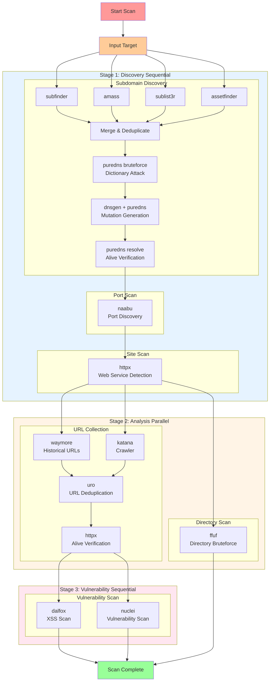
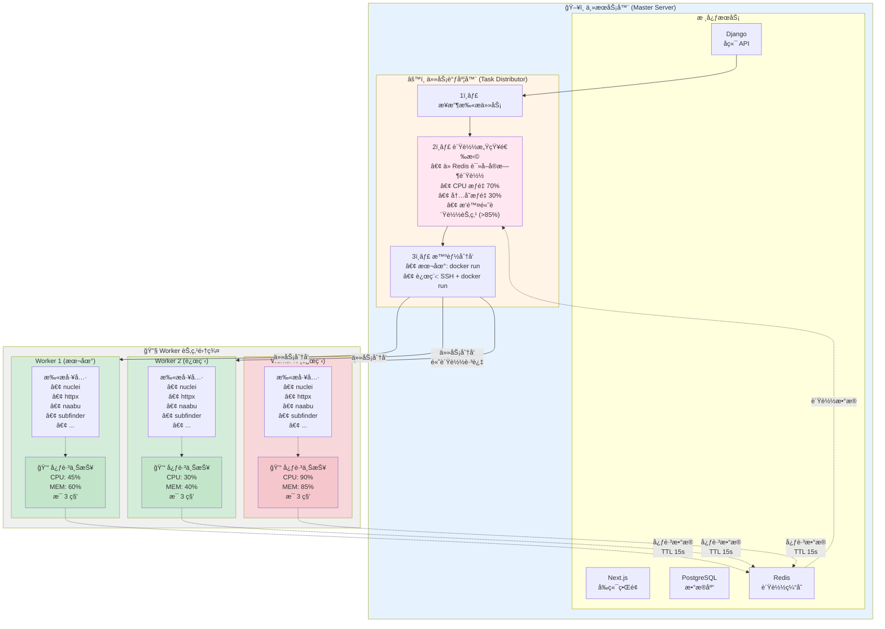

<h1 align="center">Xingrin - 星ç¯</h1>

<p align="center">
  <b>一款ç°ä»£åŒ–çš„ä¼ä¸šçº§æ¼æ´æ‰«æä¸èµ„产管ç†å¹³å°</b><br>
  æ供自动化安全检测ã€èµ„产å‘ç°ã€æ¼æ´ç®¡ç†ç­‰åŠŸèƒ½
</p>

<p align="center">
  <b>🌗 æ˜æš—模å¼åˆ‡æ¢</b>
</p>

<p align="center">
  
  
</p>

<p align="center">
  <b>ğŸ¨ å¤šç§ UI 主题</b>
</p>

<p align="center">
  
  
  
</p>

## 📚 文档

- [📖 技术文档](./docs/README.md) - 技术文档导航（🚧 æŒç»­å®Œå–„中）
- [🚀 快速开始](./docs/quick-start.md) - 一键安装和部署指å—
- [🔄 版本管ç†](./docs/version-management.md) - Git Tag 驱动的自动化版本管ç†ç³»ç»Ÿ
- [📦 Nuclei 模æ¿æ¶æ„](./docs/nuclei-template-architecture.md) - 模æ¿ä»“库的存储ä¸åŒæ­¥
- [📖 字典文件æ¶æ„](./docs/wordlist-architecture.md) - 字典文件的存储ä¸åŒæ­¥
- [🔠扫ææµç¨‹æ¶æ„](./docs/scan-flow-architecture.md) - 完整扫ææµç¨‹ä¸å·¥å…·ç¼–æ’


---

## ✨ 功能特性

### 🯠目标ä¸èµ„产管ç†
- **组织管ç†** - 多层级目标组织，çµæ´»åˆ†ç»„
- **目标管ç†** - 支æŒåŸŸåã€IP目标类å‹
- **资产å‘ç°** - å­åŸŸåã€ç½‘ç«™ã€ç«¯ç‚¹ã€ç›®å½•è‡ªåŠ¨å‘ç°
- **资产快照** - 扫æ结æœå¿«ç…§å¯¹æ¯”，追踪资产å˜åŒ–

### 🔠æ¼æ´æ‰«æ
- **多引æ“支æŒ** - é›†æˆ Nuclei 等主æµæ‰«æ引æ“
- **自定义æµç¨‹** - YAML é…置扫ææµç¨‹ï¼Œçµæ´»ç¼–æ’
- **定时扫æ** - Cron 表达å¼é…置，自动化周期扫æ

#### 扫ææµç¨‹æ¶æ„

完整的扫ææµç¨‹åŒ…括：å­åŸŸåå‘ç°ã€ç«¯å£æ‰«æã€ç«™ç‚¹å‘ç°ã€URL 收集ã€ç›®å½•æ‰«æã€æ¼æ´æ‰«æ

```mermaid
flowchart TB
    START[Start Scan]
    TARGET[Input Target]
    
    START --> TARGET
    
    subgraph STAGE1["Stage 1: Discovery Sequential"]
        direction TB
        
        subgraph SUB["Subdomain Discovery"]
            direction TB
            SUBFINDER[subfinder]
            AMASS[amass]
            SUBLIST3R[sublist3r]
            ASSETFINDER[assetfinder]
            MERGE[Merge & Deduplicate]
            BRUTEFORCE[puredns bruteforce<br/>Dictionary Attack]
            MUTATE[dnsgen + puredns<br/>Mutation Generation]
            RESOLVE[puredns resolve<br/>Alive Verification]
            
            SUBFINDER --> MERGE
            AMASS --> MERGE
            SUBLIST3R --> MERGE
            ASSETFINDER --> MERGE
            MERGE --> BRUTEFORCE
            BRUTEFORCE --> MUTATE
            MUTATE --> RESOLVE
        end
        
        subgraph PORT["Port Scan"]
            NAABU[naabu<br/>Port Discovery]
        end
        
        subgraph SITE["Site Scan"]
            HTTPX1[httpx<br/>Web Service Detection]
        end
        
        RESOLVE --> NAABU
        NAABU --> HTTPX1
    end
    
    TARGET --> SUBFINDER
    TARGET --> AMASS
    TARGET --> SUBLIST3R
    TARGET --> ASSETFINDER
    
    subgraph STAGE2["Stage 2: Analysis Parallel"]
        direction TB
        
        subgraph URL["URL Collection"]
            direction TB
            WAYMORE[waymore<br/>Historical URLs]
            KATANA[katana<br/>Crawler]
            URO[uro<br/>URL Deduplication]
            HTTPX2[httpx<br/>Alive Verification]
            
            WAYMORE --> URO
            KATANA --> URO
            URO --> HTTPX2
        end
        
        subgraph DIR["Directory Scan"]
            FFUF[ffuf<br/>Directory Bruteforce]
        end
    end
    
    HTTPX1 --> WAYMORE
    HTTPX1 --> KATANA
    HTTPX1 --> FFUF
    
    subgraph STAGE3["Stage 3: Vulnerability Sequential"]
        direction TB
        
        subgraph VULN["Vulnerability Scan"]
            direction LR
            DALFOX[dalfox<br/>XSS Scan]
            NUCLEI[nuclei<br/>Vulnerability Scan]
        end
    end
    
    HTTPX2 --> DALFOX
    HTTPX2 --> NUCLEI
    
    DALFOX --> FINISH
    NUCLEI --> FINISH
    FFUF --> FINISH
    
    FINISH[Scan Complete]
    
    style START fill:#ff9999
    style FINISH fill:#99ff99
    style TARGET fill:#ffcc99
    style STAGE1 fill:#e6f3ff
    style STAGE2 fill:#fff4e6
    style STAGE3 fill:#ffe6f0
```

详细说æ˜è¯·æŸ¥çœ‹ [扫ææµç¨‹æ¶æ„文档](./docs/scan-flow-architecture.md)

### ğŸ–¥ï¸ åˆ†å¸ƒå¼æ¶æ„
- **多节点扫æ** - 支æŒéƒ¨ç½²å¤šä¸ª Worker 节点，横å‘扩展扫æ能力
- **本地节点** - 零é…置，安装å³è‡ªåŠ¨æ³¨å†Œæœ¬åœ° Docker Worker
- **远程节点** - SSH 一键部署远程 VPS 作为扫æ节点
- **负载感知调度** - å®æ—¶æ„ŸçŸ¥èŠ‚点负载，自动分å‘任务到最优节点
- **节点监æ§** - å®æ—¶å¿ƒè·³æ£€æµ‹ï¼ŒCPU/内存/ç£ç›˜çŠ¶æ€ç›‘æ§
- **断线é‡è¿** - 节点离线自动检测，æ¢å¤å自动é‡æ–°æ¥å…¥


```mermaid
flowchart TB
    subgraph MASTER["ğŸ–¥ï¸ ä¸»æœåŠ¡å™¨ (Master Server)"]
        direction TB
        
        subgraph SERVICES["核心æœåŠ¡"]
            direction LR
            FRONTEND["Next.js<br/>å‰ç«¯ç•Œé¢"]
            BACKEND["Django<br/>å端 API"]
            DB["PostgreSQL<br/>æ•°æ®åº“"]
            REDIS["Redis<br/>负载缓存"]
        end
        
        subgraph SCHEDULER["âš™ï¸ ä»»åŠ¡è°ƒåº¦å™¨ (Task Distributor)"]
            direction TB
            SUBMIT["1ï¸âƒ£ æ¥æ”¶æ‰«æ任务"]
            SELECT["2ï¸âƒ£ 负载感知选择<br/>• ä» Redis 读å–å®æ—¶è´Ÿè½½<br/>• CPU æƒé‡ 70%<br/>• 内存æƒé‡ 30%<br/>• æ’除高负载节点 (>85%)"]
            DISPATCH["3ï¸âƒ£ 智能分å‘<br/>• 本地: docker run<br/>• 远程: SSH + docker run"]
            
            SUBMIT --> SELECT
            SELECT --> DISPATCH
        end
        
        BACKEND --> SUBMIT
        REDIS -.负载数æ®.-> SELECT
    end
    
    subgraph WORKERS["🔧 Worker 节点集群"]
        direction TB
        
        subgraph W1["Worker 1 (本地)"]
            direction TB
            W1_TOOLS["扫æ工具<br/>• nuclei<br/>• httpx<br/>• naabu<br/>• subfinder<br/>• ..."]
            W1_HEART["💓 心跳上报<br/>CPU: 45%<br/>MEM: 60%<br/>æ¯ 3 秒"]
            W1_TOOLS -.-> W1_HEART
        end
        
        subgraph W2["Worker 2 (远程)"]
            direction TB
            W2_TOOLS["扫æ工具<br/>• nuclei<br/>• httpx<br/>• naabu<br/>• subfinder<br/>• ..."]
            W2_HEART["💓 心跳上报<br/>CPU: 30%<br/>MEM: 40%<br/>æ¯ 3 秒"]
            W2_TOOLS -.-> W2_HEART
        end
        
        subgraph W3["Worker N (远程)"]
            direction TB
            W3_TOOLS["扫æ工具<br/>• nuclei<br/>• httpx<br/>• naabu<br/>• subfinder<br/>• ..."]
            W3_HEART["💓 心跳上报<br/>CPU: 90%<br/>MEM: 85%<br/>æ¯ 3 秒"]
            W3_TOOLS -.-> W3_HEART
        end
    end
    
    DISPATCH -->|任务分å‘| W1
    DISPATCH -->|任务分å‘| W2
    DISPATCH -->|任务分å‘<br/>高负载跳过| W3
    
    W1_HEART -.心跳数æ®<br/>TTL 15s.-> REDIS
    W2_HEART -.心跳数æ®<br/>TTL 15s.-> REDIS
    W3_HEART -.心跳数æ®<br/>TTL 15s.-> REDIS
    
    style MASTER fill:#e6f3ff
    style SCHEDULER fill:#fff4e6
    style SELECT fill:#ffe6f0
    style WORKERS fill:#f0f0f0
    style W1 fill:#d4edda
    style W2 fill:#d4edda
    style W3 fill:#f8d7da
    style W1_HEART fill:#c3e6cb
    style W2_HEART fill:#c3e6cb
    style W3_HEART fill:#f5c6cb
```

**负载感知调度算法：**
1. **å®æ—¶ç›‘æ§** - Worker æ¯ 3 秒上报 CPU/内存/ç£ç›˜çŠ¶æ€åˆ° Redis (TTL 15秒)
2. **智能选择** - 任务æäº¤æ—¶ä» Redis 读å–所有在线节点负载，计算加æƒåˆ†æ•° (CPU×0.7 + MEM×0.3)
3. **动æ€åˆ†å‘** - 自动选择负载最ä½çš„节点执行任务，高负载节点 (>85%) 自动跳过
4. **é™çº§ç­–ç•¥** - 所有节点高负载时等待 60 秒åé‡è¯•ï¼Œé¿å…系统过载

### 📊 å¯è§†åŒ–ç•Œé¢
- **æ•°æ®ç»Ÿè®¡** - 资产/æ¼æ´ç»Ÿè®¡ä»ªè¡¨ç›˜
- **å®æ—¶é€šçŸ¥** - WebSocket 消æ¯æ¨é€
- **暗色主题** - 支æŒæ˜æš—主题切æ¢

---

## ğŸ› ï¸ æŠ€æœ¯æ ˆ

- **å‰ç«¯**: Next.js + React + TailwindCSS
- **å端**: Django + Django REST Framework
- **æ•°æ®åº“**: PostgreSQL + Redis
- **部署**: Docker + Nginx

### 🔧 内置扫æ工具

| 类别 | 工具 |
|------|------|
| å­åŸŸå爆破 | puredns, massdns, dnsgen |
| 被动å‘ç° | subfinder, amass, assetfinder, Sublist3r |
| 端å£æ‰«æ | naabu |
| 站点å‘ç° | httpx |
| 目录扫æ | ffuf |
| 爬虫 | katana |
| 被动URL收集 | waymore, uro |
| æ¼æ´æ‰«æ | nuclei, dalfox |

---

## 📦 快速开始

### ç¯å¢ƒè¦æ±‚

- **æ“作系统**: Ubuntu 20.04+ / Debian 11+ （æ¨è）
- **硬件**: 2æ ¸ 4G 内存起步，10GB+ ç£ç›˜ç©ºé—´

### 一键安装

```bash
# 克隆项目
git clone https://github.com/yyhuni/xingrin.git
cd xingrin

# 安装并å¯åŠ¨ï¼ˆç”Ÿäº§æ¨¡å¼ï¼‰
sudo ./install.sh

# å¼€å‘模å¼
sudo ./install.sh --dev
```

### 访问æœåŠ¡

- **Web ç•Œé¢**: `https://localhost` 或 `http://localhost`

### 常用命令

```bash
# å¯åŠ¨æœåŠ¡
sudo ./start.sh

# åœæ­¢æœåŠ¡
sudo ./stop.sh

# é‡å¯æœåŠ¡
sudo ./restart.sh

# å¸è½½
sudo ./uninstall.sh

# æ›´æ–°
sudo ./update.sh
```
## 日志
- 项目日志：/opt/xingrin/logs 下存储了这个项目的è¿è¡Œæ—¥å¿—ä¿¡æ¯ï¼Œerror文件存储了错误相关信æ¯ï¼Œxingrin.log存储了包括错误在内的所有项目日志
- 工具调用日志：/opt/xingrin/results 下存储了工具的è¿è¡Œç»“æœæ—¥å¿—，比如naabu，httpx等的结æœè°ƒç”¨æ—¥å¿—

## 🤠å馈ä¸è´¡çŒ®

- 🛠**如æœå‘ç° Bug** å¯ä»¥ç‚¹å‡»å³è¾¹é“¾æ¥è¿›è¡Œæ交 [Issue](https://github.com/yyhuni/xingrin/issues)
- 💡 **有新想法，比如UI设计，功能设计等** 欢è¿ç‚¹å‡»å³è¾¹é“¾æ¥è¿›è¡Œæ交建议 [Issue](https://github.com/yyhuni/xingrin/issues)
- 🔧 **想å‚ä¸å¼€å‘？** 关注我公众å·ä¸æˆ‘个人è”ç³»

## 📧 è”ç³»
- ç›®å‰ç‰ˆæœ¬å°±æˆ‘个人使用，å¯èƒ½ä¼šæœ‰å¾ˆå¤šè¾¹ç•Œé—®é¢˜
- 如有问题，建议，其他，优先æ交[Issue](https://github.com/yyhuni/xingrin/issues)，也å¯ä»¥ç›´æ¥ç»™æˆ‘的公众å·å‘消æ¯ï¼Œæˆ‘都会å›å¤çš„

- 微信公众å·: **æ´‹æ´‹çš„å°é»‘屋**


## âš ï¸ å…责声æ˜

**é‡è¦ï¼šè¯·åœ¨ä½¿ç”¨å‰ä»”细阅读**

1. 本工具仅供**æˆæƒçš„安全测试**å’Œ**安全研究**使用
2. 使用者必须确ä¿å·²è·å¾—目标系统的**åˆæ³•æˆæƒ**
3. **严ç¦**将本工具用äºæœªç»æˆæƒçš„渗é€æµ‹è¯•æˆ–攻击行为
4. 未ç»æˆæƒæ‰«æ他人系统å±äº**è¿æ³•è¡Œä¸º**，å¯èƒ½é¢ä¸´æ³•å¾‹è´£ä»»
5. å¼€å‘者**ä¸å¯¹ä»»ä½•æ»¥ç”¨è¡Œä¸ºè´Ÿè´£**

使用本工具å³è¡¨ç¤ºæ‚¨åŒæ„：
- 仅在åˆæ³•æˆæƒèŒƒå›´å†…使用
- éµå®ˆæ‰€åœ¨åœ°åŒºçš„法律法规
- 承担因滥用产生的一切åæœ

## 📄 许å¯è¯

本项目采用 [PolyForm Noncommercial License 1.0.0](LICENSE) 许å¯è¯ã€‚

### å…许的用途

- ✅ 个人学习和研究
- ✅ é商业安全测试
- ✅ 教育机æ„使用
- ✅ éè¥åˆ©ç»„织使用

### ç¦æ­¢çš„用途

- ⌠**商业用途**（包括但ä¸é™äºï¼šå‡ºå”®ã€å•†ä¸šæœåŠ¡ã€SaaS 等）
- ⌠未ç»æˆæƒçš„渗é€æµ‹è¯•
- ⌠任何è¿æ³•è¡Œä¸º

如需商业æˆæƒï¼Œè¯·è”系作者。

