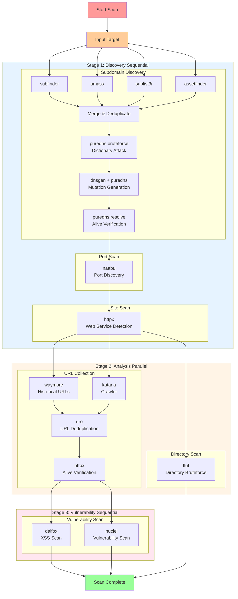

# 扫描流程架构

## 完整扫描流程



## 执行阶段定义

```python
# backend/apps/scan/configs/command_templates.py
EXECUTION_STAGES = [
    {'mode': 'sequential', 'flows': ['subdomain_discovery', 'port_scan', 'site_scan']},
    {'mode': 'parallel', 'flows': ['url_fetch', 'directory_scan']},
    {'mode': 'sequential', 'flows': ['vuln_scan']},
]
```

## 各阶段输出

| Flow | 工具 | 输出表 |
|------|------|--------|
| subdomain_discovery | subfinder, amass, sublist3r, assetfinder, puredns | Subdomain |
| port_scan | naabu | HostPortMapping |
| site_scan | httpx | WebSite |
| url_fetch | waymore, katana, uro, httpx | Endpoint |
| directory_scan | ffuf | Directory |
| vuln_scan | dalfox, nuclei | Vulnerability |
