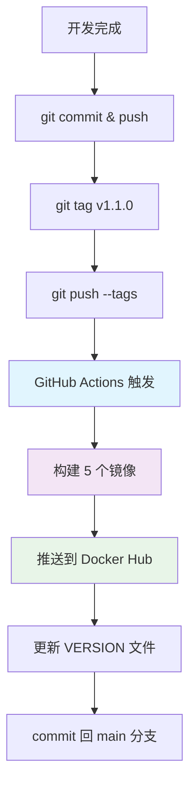
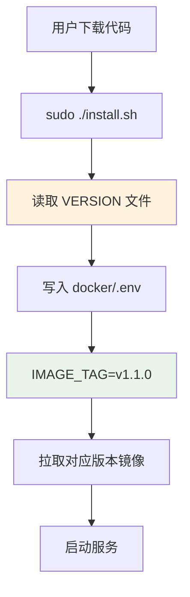
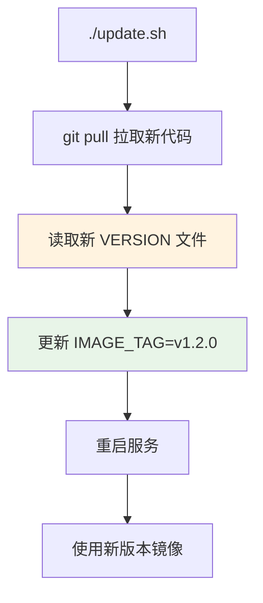
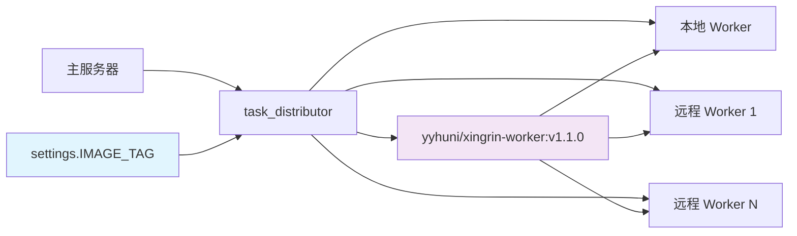
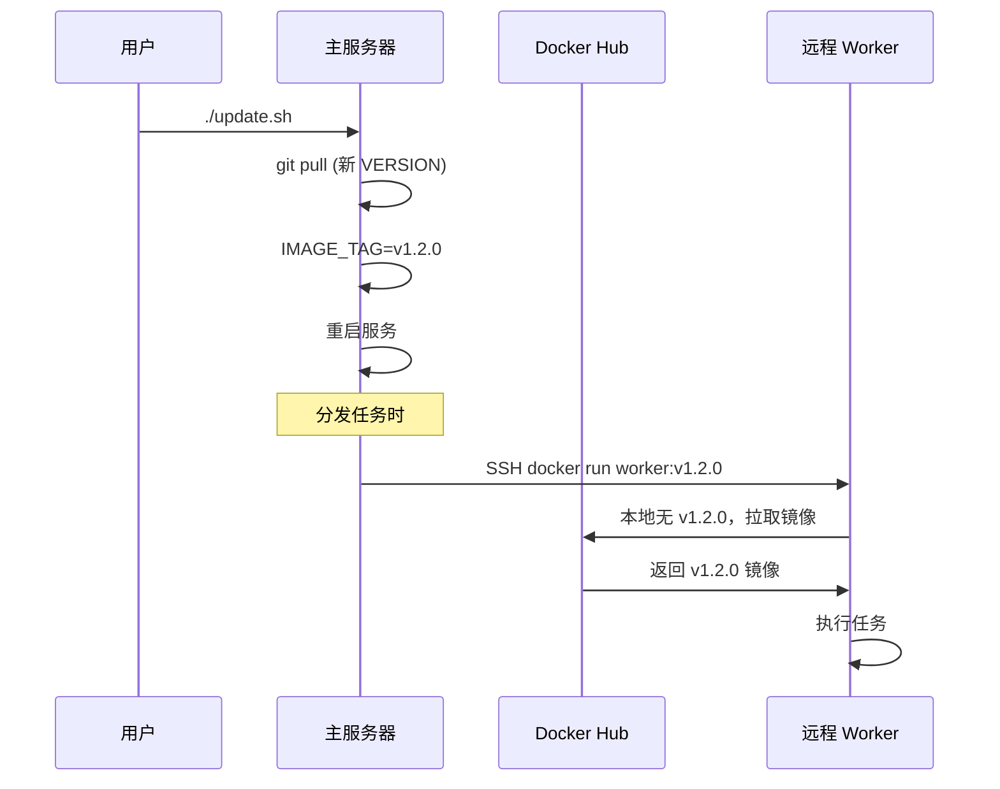
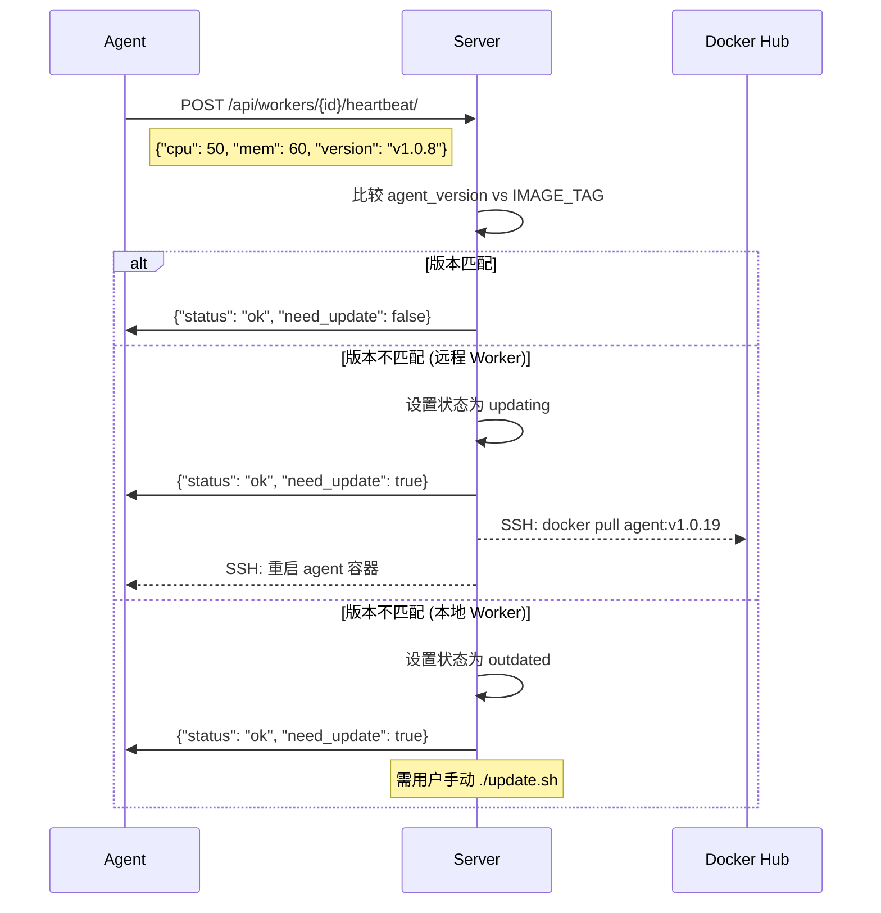

# XingRin - 星环 版本管理架构

## 概述

XingRin - 星环 采用基于 Git Tag 的自动化版本管理系统，确保所有组件（主服务器、远程 Worker）使用一致的版本，避免兼容性问题。

## 核心原理

### 版本号来源
- **单一版本源**：Git Tag（如 `v1.1.0`）
- **版本文件**：`VERSION` 文件由 CI 自动维护
- **环境变量**：`IMAGE_TAG` 锁定运行时版本

### 版本一致性保证
```
Git Tag → CI 构建镜像 → VERSION 文件 → IMAGE_TAG → 所有节点统一版本
```

## 完整发布流程



### 镜像构建矩阵
| 镜像 | 用途 | 标签 |
|------|------|------|
| `xingrin-server` | 主服务器 | `v1.1.0` + `latest` |
| `xingrin-frontend` | 前端界面 | `v1.1.0` + `latest` |
| `xingrin-nginx` | 反向代理 | `v1.1.0` + `latest` |
| `xingrin-worker` | 任务执行 | `v1.1.0` + `latest` |
| `xingrin-agent` | 心跳监控 | `v1.1.0` + `latest` |

## 用户部署流程

### 初始安装


### 版本更新


## 任务分发架构

### 镜像版本管理


### 执行流程对比

| 场景 | 镜像拉取策略 | 说明 |
|------|-------------|------|
| **本地 Worker** | `--pull=missing` | 主服务器本机执行，使用本地镜像 |
| **远程 Worker** | `--pull=missing` | SSH 到远程执行，使用远程本地镜像 |

## 镜像拉取策略

### 安装时预拉取
```bash
# 主服务器安装
docker compose up -d  # 拉取所有服务镜像

# 远程 Worker 安装  
docker pull yyhuni/xingrin-worker:v1.1.0  # 预拉取 worker 镜像
```

### 执行时策略
```bash
# 任务执行时
docker run --pull=missing yyhuni/xingrin-worker:v1.1.0
```

**`--pull=missing` 行为**：
- ✅ 本地有镜像 → 直接使用，不检查网络
- ✅ 本地无镜像 → 从 Docker Hub 拉取
- ✅ 版本更新后 → 自动拉取新版本

## 版本同步机制

### 主服务器更新


### 版本一致性保证
1. **主服务器**：`IMAGE_TAG` 锁定版本
2. **远程 Worker**：按需拉取对应版本
3. **自动同步**：update.sh 统一更新版本号

## Agent 自动更新机制

### 概述

Agent 是运行在每个 Worker 节点上的轻量级心跳服务（~10MB），负责上报节点状态和负载信息。当主服务器更新后，Agent 需要同步更新以保持版本一致。

### 版本检测流程



### Worker 状态流转

| 场景 | 状态变化 | 说明 |
|------|---------|------|
| 首次心跳 | `pending/deploying` → `online` | Agent 启动成功 |
| 远程 Worker 版本不匹配 | `online` → `updating` → `online` | 服务端自动 SSH 更新 |
| 远程 Worker 更新失败 | `updating` → `outdated` | SSH 执行失败 |
| 本地 Worker 版本不匹配 | `online` → `outdated` | 需手动 update.sh |
| 版本匹配 | `updating/outdated` → `online` | 恢复正常 |

### 更新触发条件

1. **远程 Worker**：服务端检测到版本不匹配时，自动通过 SSH 执行更新
2. **本地 Worker**：用户执行 `./update.sh` 时，docker-compose 会拉取新镜像并重启

### 防重复机制

使用 Redis 锁防止同一 Worker 在 60 秒内重复触发更新：
```
lock_key = f"agent_update_lock:{worker_id}"
redis.set(lock_key, "1", nx=True, ex=60)
```

### 相关文件

| 文件 | 作用 |
|------|------|
| `backend/apps/engine/views/worker_views.py` | 心跳 API，版本检测和更新触发 |
| `backend/scripts/worker-deploy/agent.sh` | Agent 心跳脚本，上报版本号 |
| `backend/scripts/worker-deploy/start-agent.sh` | Agent 启动脚本 |
| `docker/agent/Dockerfile` | Agent 镜像构建，注入 IMAGE_TAG |

## 开发环境配置

### 本地开发测试
```bash
# docker/.env 中添加（开发模式会自动设置）
TASK_EXECUTOR_IMAGE=docker-worker:v1.1.0-dev  # 指向本地构建镜像
```

### 开发模式启动
```bash
# 使用本地构建镜像（自动构建并标记为 ${VERSION}-dev）
./install.sh --dev
./start.sh --dev
```

## 配置文件说明

### VERSION 文件
```
v1.1.0
```
- 由 CI 自动维护
- 用户安装时读取此文件

### docker/.env
```bash
IMAGE_TAG=v1.1.0                    # 锁定版本
TASK_EXECUTOR_IMAGE=                # 可选：覆盖镜像名
```

### settings.py 逻辑
```python
if IMAGE_TAG:
    # 主服务器：构建镜像名
    TASK_EXECUTOR_IMAGE = f'{DOCKER_USER}/xingrin-worker:{IMAGE_TAG}'
else:
    # Worker 容器：不需要此配置
    TASK_EXECUTOR_IMAGE = ''
```

## Agent 自动更新机制

### 概述

Agent 是运行在每个 Worker 节点上的轻量级心跳服务，负责上报节点状态和负载信息。当主服务器更新后，Agent 需要同步更新以保持版本一致。

### 版本检测流程

### 版本不一致问题
**症状**：任务执行失败，兼容性错误

**排查**：
```bash
# 检查主服务器版本
cat VERSION
grep IMAGE_TAG docker/.env

# 检查远程 Worker 镜像
ssh worker_host "docker images | grep xingrin-worker"
```

**解决**：
```bash
# 主服务器更新
./update.sh

# 远程 Worker 会自动拉取新版本（下次任务执行时）
```

### 镜像拉取失败
**症状**：`docker run` 报错，无法拉取镜像

**排查**：
```bash
# 检查网络连接
docker pull yyhuni/xingrin-worker:v1.1.0

# 检查版本是否存在
curl -s https://hub.docker.com/v2/repositories/yyhuni/xingrin-worker/tags/
```

## 最佳实践

### 版本发布
1. ✅ 严格遵循语义化版本（v1.2.3）
2. ✅ 有改动必须更新版本号
3. ✅ 通过 CI 自动构建，不手动推送
4. ✅ 测试版本使用 `-dev.x` 后缀

### 部署运维
1. ✅ 定期执行 `./update.sh` 获取更新
2. ✅ 监控 Docker Hub 镜像拉取状态
3. ✅ 备份重要配置文件（.env）
4. ✅ 使用 `docker system prune` 清理旧镜像

### 开发调试
1. ✅ 本地测试使用 `--dev` 模式（自动构建 `docker-worker:${VERSION}-dev`）
2. ✅ 远程测试先推送测试版本到 Hub
3. ✅ 生产环境避免使用 `latest` 标签，始终使用明确版本号
4. ✅ 开发环境使用 `-dev` 后缀区分开发版本
5. ✅ 版本回滚通过修改 `IMAGE_TAG` 实现