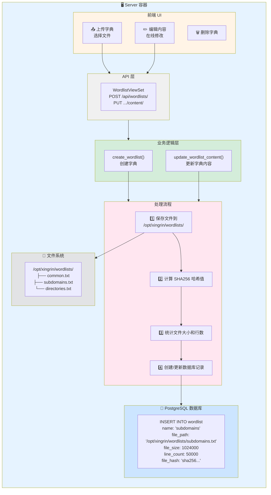
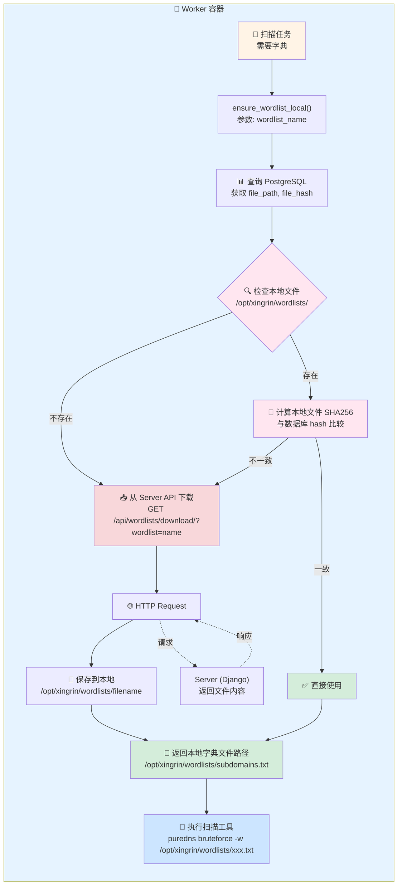
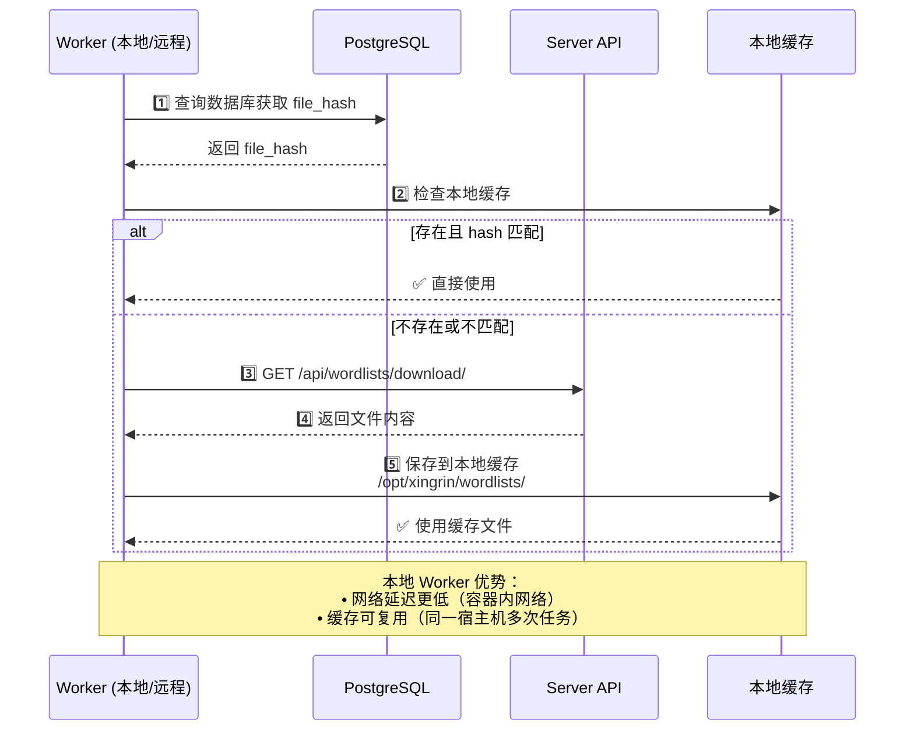

# 字典文件管理架构

本文档介绍 XingRin 中字典文件的存储、同步和使用机制。

## 目录结构

```
/opt/xingrin/wordlists/
├── common.txt              # 通用字典
├── subdomains.txt          # 子域名字典
├── directories.txt         # 目录字典
└── ...
```

## 一、存储位置

| 配置项 | 默认值 | 说明 |
|--------|--------|------|
| `WORDLISTS_BASE_PATH` | `/opt/xingrin/wordlists` | 字典文件存储目录 |

## 二、数据模型

```
Wordlist
├── id          # 字典 ID
├── name        # 字典名称（唯一，用于查询）
├── description # 描述
├── file_path   # 文件绝对路径
├── file_size   # 文件大小（字节）
├── line_count  # 行数
└── file_hash   # SHA256 哈希值（用于校验）
```

## 三、Server 端上传流程

1. 用户在前端上传字典文件
2. `WordlistService.create_wordlist()` 处理：
   - 保存文件到 `WORDLISTS_BASE_PATH` 目录
   - 计算 SHA256 哈希值
   - 统计文件大小和行数
   - 创建数据库记录



## 四、Worker 端获取流程

Worker 执行扫描任务时，通过 `ensure_wordlist_local()` 获取字典：

1. 根据字典名称查询数据库，获取 `file_path` 和 `file_hash`
2. 检查本地是否存在字典文件
   - 存在且 hash 匹配：直接使用
   - 存在但 hash 不匹配：重新下载
   - 不存在：从 Server API 下载
3. 下载地址：`GET /api/wordlists/download/?wordlist=<name>`
4. 返回本地字典文件路径



## 五、Hash 校验机制

- 上传时计算 SHA256 并存入数据库
- Worker 使用前校验本地文件 hash
- 不匹配时自动重新下载
- 确保所有节点使用相同内容的字典

## 六、本地 Worker vs 远程 Worker

本地 Worker 和远程 Worker 获取字典的方式相同：

1. 从数据库查询字典元数据（file_hash）
2. 检查本地缓存是否存在且 hash 匹配
3. 不匹配则通过 HTTP API 下载

**注意**：Worker 容器只挂载了 `results` 和 `logs` 目录，没有挂载 `wordlists` 目录，所以字典文件需要通过 API 下载。



### 本地 Worker 的优势

虽然获取方式相同，但本地 Worker 有以下优势：
- 网络延迟更低（容器内网络）
- 下载后的缓存可复用（同一宿主机上的多次任务）

## 七、配置项

在 `docker/.env` 或环境变量中配置：

```bash
# 字典文件存储目录
WORDLISTS_PATH=/opt/xingrin/wordlists

# Server 地址（Worker 用于下载文件）
PUBLIC_HOST=your-server-ip
SERVER_PORT=8888
```

## 八、常见问题

### Q: 字典文件更新后 Worker 没有使用新版本？

A: 更新字典内容后会重新计算 hash，Worker 下次使用时会检测到 hash 不匹配并重新下载。

### Q: 远程 Worker 下载文件失败？

A: 检查：
1. `PUBLIC_HOST` 是否配置为 Server 的外网 IP
2. Server 端口（默认 8888）是否开放
3. Worker 到 Server 的网络是否通畅

### Q: 如何批量导入字典？

A: 目前只支持通过前端逐个上传，后续可能支持批量导入功能。
